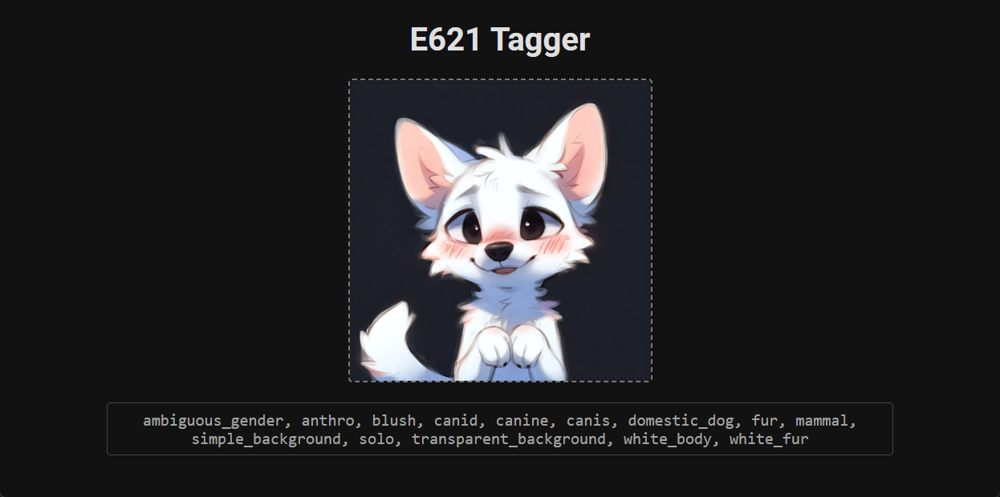

# E621 Tagger

A web application that provides automatic image tagging using a trained deep learning model. The model is trained on e621 data to predict relevant tags for images. NSFW and SFW images are compatible. No GPU required.

## Installation

1. Clone the repository `git clone https://github.com/Poofy1/e621-tagger.git`

2. Execute `run.bat`
